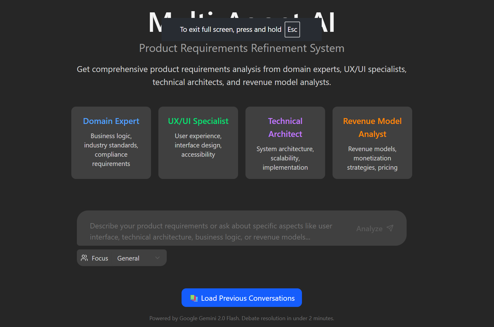
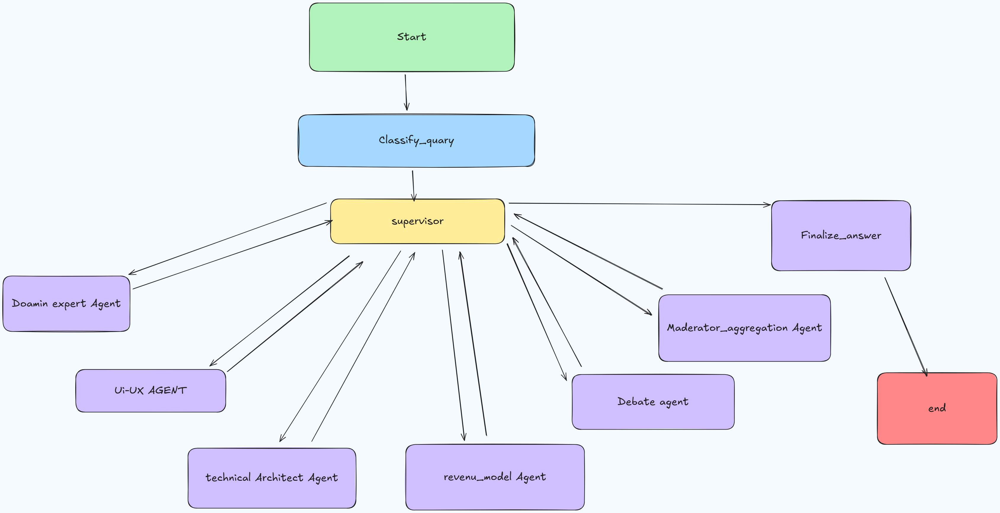

# Multi-Agent AI for Product Requirements Refinement

This project demonstrates a sophisticated multi-agent AI system designed to refine product requirements through specialized agent interactions, aggregate feedback, and generate comprehensive visualizations of changes. The system includes advanced debate handling capabilities that resolve conflicts in under 2 minutes for maximum efficiency.



## Features

- 🤖 **Multi-Agent Architecture**: Specialized agents for Domain Expert, UX/UI Specialist, Technical Architect, and Moderator/Aggregator
- ⚡ **Efficient Debate Resolution**: Automated debate analysis and routing to appropriate specialists (under 2 minutes)
- 🔄 **Parallel Processing**: Multiple specialist agents work simultaneously for faster results
- 📊 **Comprehensive Analysis**: Business logic, user experience, technical architecture, and conflict resolution
- 🎯 **Smart Query Classification**: Automatic routing to the most appropriate specialist based on query content
- 💬 **Real-time Feedback**: Live activity timeline showing agent progress and interactions
- 🌐 **Fullstack Application**: React frontend with LangGraph-powered backend
- 🚀 **Optimized Performance**: Uses Google Gemini 2.0 Flash model for all agent interactions

## System Architecture

The system implements a sophisticated multi-agent workflow as shown in the flow diagram:



### Agent Specializations

1. **Domain Expert**: Analyzes business logic, industry standards, compliance requirements, and domain-specific knowledge
2. **UX/UI Specialist**: Handles user experience requirements, interface design, accessibility, and usability patterns
3. **Technical Architect**: Manages system architecture, technology stack, scalability, and implementation requirements
4. **Moderator/Aggregator**: Consolidates feedback from all specialists and resolves conflicts
5. **Debate Handler**: Analyzes and routes debates to appropriate specialists for efficient resolution

## Project Structure

The project is divided into two main directories:

-   `frontend/`: Contains the React application built with Vite and TypeScript
-   `backend/`: Contains the LangGraph/FastAPI application with the multi-agent system

## Getting Started: Development and Local Testing

Follow these steps to get the application running locally for development and testing.

**1. Prerequisites:**

-   Node.js and npm (or yarn/pnpm)
-   Python 3.11+
-   **`GEMINI_API_KEY`**: The backend requires a Google Gemini API key.
    1.  Navigate to the `backend/` directory.
    2.  Create a file named `.env` by copying the `backend/.env.example` file.
    3.  Open the `.env` file and add your Gemini API key: `GEMINI_API_KEY="YOUR_ACTUAL_API_KEY"`

**2. Install Dependencies:**

**Backend:**
```bash
cd backend
pip install -r requirements.txt

```

**Frontend:**
```bash
cd frontend
npm install
```

**3. Run Development Servers:**

**Backend**
```bash
langgraph dev --allow-blocking
```
**Backend**
```bash
npm run dev
```

This will run the backend and frontend development servers. Open your browser and navigate to the frontend development server URL (e.g., `http://localhost:5173/app`).

_Alternatively, you can run the backend and frontend development servers separately. For the backend, open a terminal in the `backend/` directory and run `langgraph dev`. The backend API will be available at `http://127.0.0.1:2024`. For the frontend, open a terminal in the `frontend/` directory and run `npm run dev`. The frontend will be available at `http://localhost:5173`._

## How the Multi-Agent System Works

The core of the backend is a LangGraph-based multi-agent system defined in `backend/src/agent/graph.py`. It follows these steps:

1. **Query Classification**: Analyzes user input to determine the most appropriate specialist agent(s) to handle the request
2. **Parallel Specialist Analysis**: Routes queries to Domain Expert, UX/UI Specialist, and/or Technical Architect based on classification
3. **Debate Detection & Routing**: Automatically detects debates and routes them to appropriate specialists for resolution
4. **Moderator Aggregation**: Consolidates feedback from all specialists and resolves any conflicts
5. **Final Answer Generation**: Creates a comprehensive, well-structured final answer based on all specialist analyses

### Debate Handling Workflow

The system includes sophisticated debate handling capabilities:

- **Automatic Detection**: Identifies debate content through keyword analysis
- **Smart Routing**: Routes debates to the most appropriate specialist based on content analysis
- **Efficiency Focus**: Targets resolution in under 2 minutes for optimal productivity
- **Conflict Resolution**: Moderator agent resolves conflicts between specialist perspectives

### Model Configuration

The system uses **Google Gemini 2.0 Flash** for all agent interactions, ensuring:
- **Consistent Performance**: Same model across all specialist agents
- **Optimized Speed**: Fast response times for real-time interactions
- **Cost Efficiency**: Single model reduces API costs
- **Reliable Results**: Consistent quality across all analyses

## API Endpoints

The system provides several REST API endpoints:

- `POST /api/refine-requirements`: Main endpoint for product requirements refinement
- `GET /api/health`: Health check endpoint
- `GET /api/agents`: Information about available specialist agents

## CLI Example

For quick testing, you can use the CLI example:

```bash
cd backend
python examples/cli_research.py "What are the requirements for a mobile banking app?"
```

## Deployment

In production, the backend server serves the optimized static frontend build. LangGraph requires a Redis instance and a Postgres database for state management and real-time streaming.

**1. Build the Docker Image:**
```bash
docker build -t multi-agent-requirements -f Dockerfile .
```

**2. Run the Production Server:**
```bash
GEMINI_API_KEY=<your_gemini_api_key> LANGSMITH_API_KEY=<your_langsmith_api_key> docker-compose up
```

Open your browser and navigate to `http://localhost:8123/app/` to see the application.

## Technologies Used

- [React](https://reactjs.org/) (with [Vite](https://vitejs.dev/)) - For the frontend user interface
- [TypeScript](https://www.typescriptlang.org/) - For type-safe development
- [Tailwind CSS](https://tailwindcss.com/) - For styling
- [Shadcn UI](https://ui.shadcn.com/) - For components
- [LangGraph](https://github.com/langchain-ai/langgraph) - For building the multi-agent system
- [Google Gemini 2.0 Flash](https://ai.google.dev/models/gemini) - LLM for all agent interactions
- [FastAPI](https://fastapi.tiangolo.com/) - For the backend API

## License

This project is licensed under the Apache License 2.0. See the [LICENSE](LICENSE) file for details. 
